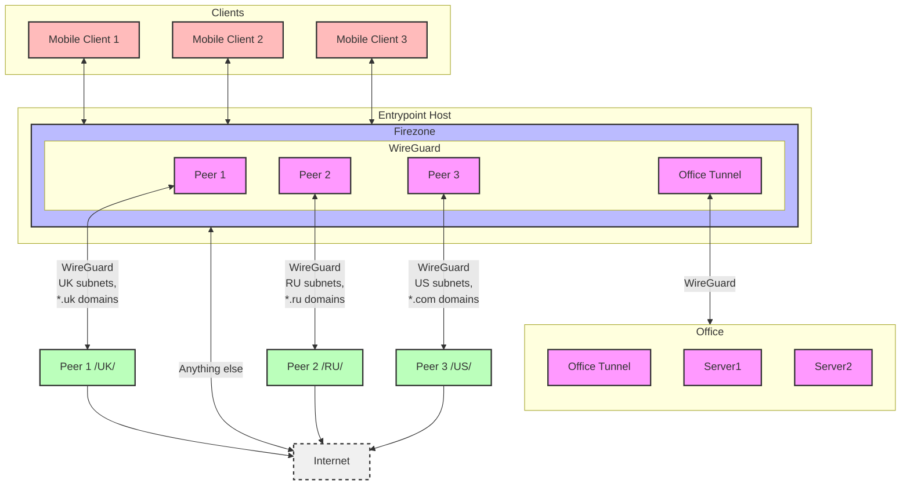

MRVPN2
======

The idea of MRVPN2 is to provide a simple way to deploy a VPN infrastructure with the following features:
1. Geo routing - route the traffic based on the destination IP country code. For example, you might want the traffic to UK IPs to be routed through the UK exit host
2. Domain routing - route the traffic based on the destination domain. For example, you might want the traffic to *.ru domains to be routed through the RU exit host
3. Ability to connect everything in  a mesh. Which mean, accordingly to the below graph: 
   The mobile client, by connecting the EntryPoint to be able to access the office services.




Techniques used
===
The MRVPN uses following techniques.

Deploying Wireguard tunnels on its own
---
The exit server or office router needs to be connected with entrypoint host. In order to connect, the tunnel should be setup.
The MRVPN uses docker-wireguard role to perform deployment of single tunnel to either debian-based os or mikrotik.   
The sole tunnels are deployed as a light docker compose containers to the host.  

On the entrypoint host the tunnel counterpart must be integrated into the firezone stack. To achieve this the compose patching is used.

Compose patching.
---
The compose patching is a technique to inject the services into the existing docker-compose stack. 
The MRVPN uses the docker-compose patching to inject the wireguard tunnels into the firezone stack.
To achieve this you can declare the tunnel peer with  compose_service or compose_network
```yaml
tunnels:
    wg_uk:
      mrvpn-entry:
        allowed_nets: [ 0.0.0.0/0]
        # The compose service, this peer will be injected.
        # In this case the wg_uk tunnel will be run in the firezone compose service namespace.
        compose_service: firezone 
        masquerade: true
        table: "off"
```
Resulting docker config will look like this:

/opt/mrvpn/docker-compose.yml 
```yaml
include:
-   path:
    # the firezone compose stack
    - /opt/mrvpn/firezone/docker-compose.yml
    # the wg_tik injected tunnel
    - /opt/mrvpn/wg_tunnels/wg_tik/docker-compose.yml
```
opt/mrvpn/wg_tunnels/wg_tik/docker-compose.yml
```yaml
services:
  wg_tik:
    restart: unless-stopped
    build:
      context: /opt/mrvpn/wg_tunnels/wg_tik/wg-tunnel
    cap_add:
      - NET_ADMIN
    sysctls:
      - net.ipv4.conf.all.src_valid_mark=1
    volumes:
      - /opt/mrvpn/wg_tunnels/wg_tik/interface/interface.conf:/conf/interface/wg_tik.conf
      - /opt/mrvpn/wg_tunnels/wg_tik/peers:/conf/peers
    environment:
       WG_INTERFACE: "wg_tik"
  
  # The magic part     
  # The injection into the firezone service network namespace
    network_mode: "service:firezone"

 # The compose merge patch. wg_tik wireguard needs to expose listening port. We're patching firezone service to expose the port 
  firezone:
    ports:
      - 55825:55825/udp
```
OSPF routing
---
In order to achieve the goal of meshing the network without masquerading, the OSPF routing is used.
It is deployed as a part of the MRVPN suite to the entrypoint host and injected into firezone namespace.
```yaml
services:
    firezone_pdns:
        restart: always
        build: ./powerdns
        cap_add: [ NET_ADMIN ]
        volumes:
            - "/opt/mrvpn/mrvpn/powerdns/etc:/etc/powerdns"
        network_mode: "service:firezone"
        environment:
            - "MRVPN_INTERFACES=wg-firezone,wg_uk,wg_tik"
    firezone_ipt:
        restart: always
        build: ./ipt-server
        cap_add: [ NET_ADMIN ]
        network_mode: "service:firezone"
        volumes:
            - "/opt/mrvpn/mrvpn/ipt-server-config.yml:/settings.yaml"
    firezone_frr:
        restart: always
        cap_add:
            - CAP_NET_RAW
            - NET_ADMIN
            - SYS_ADMIN
        privileged: false
        image: quay.io/frrouting/frr:9.1.0
        network_mode: "service:firezone"
        volumes:
            - /opt/mrvpn/mrvpn/frr:/etc/frr:rw

```
By deploying the docker-wireguard tunnel to mikrotik, the OSPF is configured as well.

GEO and domain routing
----
In order to precisely, yet efficiently route the traffic, the [IPT Server](roles/mrvpn2/files/ipt-server) is used.
The IPT server redirects all DNS traffic from the MRVPN_INTERFACES on entrypoint host to the powerdns recursor server, where the plugin passes responses to the ipt-server.
When response's A or PTR record is resolved, the ipt-server applies the routing rules based on the domain or geo routing schema.

The schema is defined in the [mrvpn_schema.md](roles/mrvpn2/docs/mrvpn_schema.md) file.

Additionally, the IPT applies network-based GEO routing rules.  