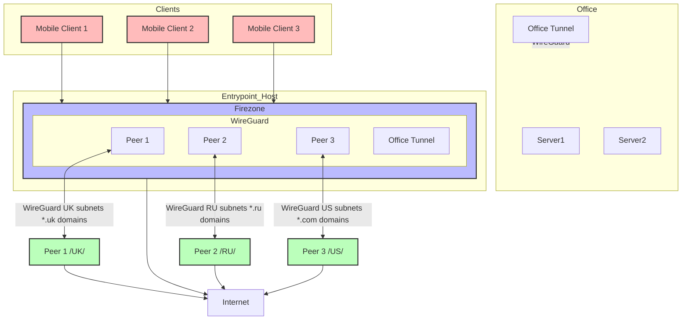

# MRVPN2

MRVPN2 is an Ansible collection for deploying VPN infrastructure using Firezone and WireGuard.

## Features

- **Geo routing** - Route traffic based on destination IP country code
- **Domain routing** - Route traffic based on destination domain
- **Mesh networking** - Connect everything in a mesh topology
- **WireGuard tunnels** - Deploy WireGuard tunnels via Docker
- **OSPF routing** - Dynamic routing with FRRouting
- **OIDC authentication** - External identity provider integration

## Project Structure

```
mrvpn2/
├── galaxy.yml                 # Ansible Galaxy collection metadata
├── README.md                  # This file
├── quickstart_guide.md        # Complete step-by-step guide
├── roles/                     # Ansible roles
│   ├── docker-wireguard/      # WireGuard tunnel management
│   ├── firezone/              # Firezone VPN server
│   └── mrvpn2/                # MRVPN2 orchestration
├── plugins/                   # Custom Ansible plugins
│   ├── modules/               # Custom Ansible modules
│   └── filter/                # Jinja2 filters
├── templates/                 # Jinja2 templates for services
├── startup-templates/         # Installation-specific configurations
│   ├── ansible.cfg            # Ansible configuration
│   ├── inventory.yml          # Ansible inventory template
│   ├── mrvpn_config.yml       # VPN topology configuration
│   ├── deployment-config.yml  # Deployment settings
│   ├── deploy_vpn.yml         # Main deployment playbook
│   ├── deploy_exit_node.yml   # Exit node deployment
│   ├── deploy-ci.yml          # CI/CD optimized deployment
│   ├── configure_oidc.yml     # OIDC configuration playbook
│   ├── galaxy.yml             # Galaxy collection template
│   ├── requirements.yml       # Ansible dependencies
│   └── .gitlab-ci.yml         # GitLab CI/CD pipeline
└── mrvpn2-master/             # Original project reference
```

## Architecture



## Quick Start

For a complete step-by-step guide with examples, see [Quick Start Guide](quickstart_guide.md).

### Basic Usage

1. Clone the repository and copy startup templates:
```bash
git clone https://github.com/your-org/mrvpn2.git
cd mrvpn2
cp -r startup-templates/* .
```

2. Edit configuration files for your environment:
   - `inventory.yml` - Server inventory
   - `mrvpn_config.yml` - VPN topology
   - `deployment-config.yml` - Deployment settings

3. Set required environment variables:
```bash
export FZ_ADMIN_PASS="your_secure_password"
export FZ_SERVER_URL="https://your-vpn.example.com"
```

4. Deploy:
```bash
ansible-playbook -i inventory.yml deploy_vpn.yml
```

## Components

### Core Components

- **Firezone** - Open-source VPN server and web interface
- **WireGuard** - Modern VPN protocol for tunnels
- **Docker** - Container runtime for services
- **FRRouting** - OSPF routing for mesh networking

### Optional Components

#### OIDC Authentication (Optional)

MRVPN2 supports external OIDC providers for authentication. Currently supported:
- **Yandex OAuth** - Direct Yandex authentication
- **Zitadel** - OIDC identity provider (deployed separately)

**Note:** OIDC is completely optional. Firezone works perfectly with built-in user management. Only configure OIDC if you need external authentication providers.

To configure OIDC after deployment:
```bash
# For Yandex OAuth
ansible-playbook -i inventory.yml configure_oidc.yml -e oidc_provider=yandex

# For Zitadel (requires separate deployment)
ansible-playbook -i inventory.yml configure_oidc.yml -e oidc_provider=zitadel
```

#### Exit Nodes (Optional)

Deploy additional WireGuard exit nodes for geo-routing:
```bash
ansible-playbook -i inventory.yml deploy_exit_node.yml
```

## Configuration

MRVPN2 uses a modular configuration approach with templates in `startup-templates/`:

- **`inventory.yml`** - Ansible inventory with server definitions
- **`mrvpn_config.yml`** - VPN topology and routing configuration
- **`deployment-config.yml`** - Deployment settings and service toggles
- **`ansible.cfg`** - Ansible configuration for the deployment

### Environment Variables

Required variables:
- `FZ_ADMIN_PASS` - Firezone admin password
- `FZ_SERVER_URL` - Firezone server URL

Optional variables:
- `YANDEX_CLIENT_ID` - Yandex OAuth client ID
- `YANDEX_CLIENT_SECRET` - Yandex OAuth client secret
- `ZITADEL_CLIENT_ID` - Zitadel client ID
- `ZITADEL_CLIENT_SECRET` - Zitadel client secret

## Deployment

### Single Command Deployment

```bash
# Install dependencies
ansible-galaxy collection install -r requirements.yml

# Deploy VPN infrastructure
ansible-playbook -i inventory.yml deploy_vpn.yml
```

### Multi-stage Deployment

```bash
# 1. Deploy main VPN server
ansible-playbook -i inventory.yml deploy_vpn.yml

# 2. Deploy exit nodes (optional)
ansible-playbook -i inventory.yml deploy_exit_node.yml

# 3. Configure OIDC (optional)
ansible-playbook -i inventory.yml configure_oidc.yml
```

### CI/CD Deployment

Use the provided `.gitlab-ci.yml` template for automated deployment through GitLab CI/CD.

## Requirements

### System Requirements
- **Ansible** 2.9+
- **Docker** with Docker Compose
- **Python** 3.6+
- **Linux servers** with SSH access

### Server Requirements
- Ubuntu/Debian
- Root or sudo access
- Internet connectivity
- At least 2GB RAM, 2 CPU cores

## Troubleshooting

### Common Issues

**SSH Connection Failed**
- Verify SSH key is properly configured
- Check server firewall allows SSH (port 22)
- Ensure user has sudo privileges

**Docker Installation Failed**
- Check internet connectivity on target servers
- Verify package manager is available
- Try manual Docker installation if automated fails

**Firewall Blocks Traffic**
- UFW rules are configured automatically
- Check server firewall status: `sudo ufw status`
- Verify required ports are open

**OIDC Configuration Issues**
- Verify OIDC provider credentials
- Check discovery document URL is accessible
- Ensure callback URLs are properly configured

### Logs and Debugging

```bash
# Ansible logs
ansible-playbook -i inventory.yml deploy_vpn.yml -vvv

# Docker logs
docker ps
docker logs <container_name>

# Service status
systemctl status firezone
systemctl status docker
```

## Security

- SSH keys used only for deployment
- Sensitive data stored in environment variables
- Firewall rules configured automatically
- Docker networks isolated
- Admin passwords should be strong and unique

## Support

For issues and questions:
1. Check the [Quick Start Guide](quickstart_guide.md) for detailed examples
2. Review Ansible and Docker logs for error details
3. Verify all environment variables are set correctly
4. Ensure server networking and firewall rules are correct

## License

GPL-2.0-or-later

## Author

Alexander K <ansible-alex@xxl.cx>  