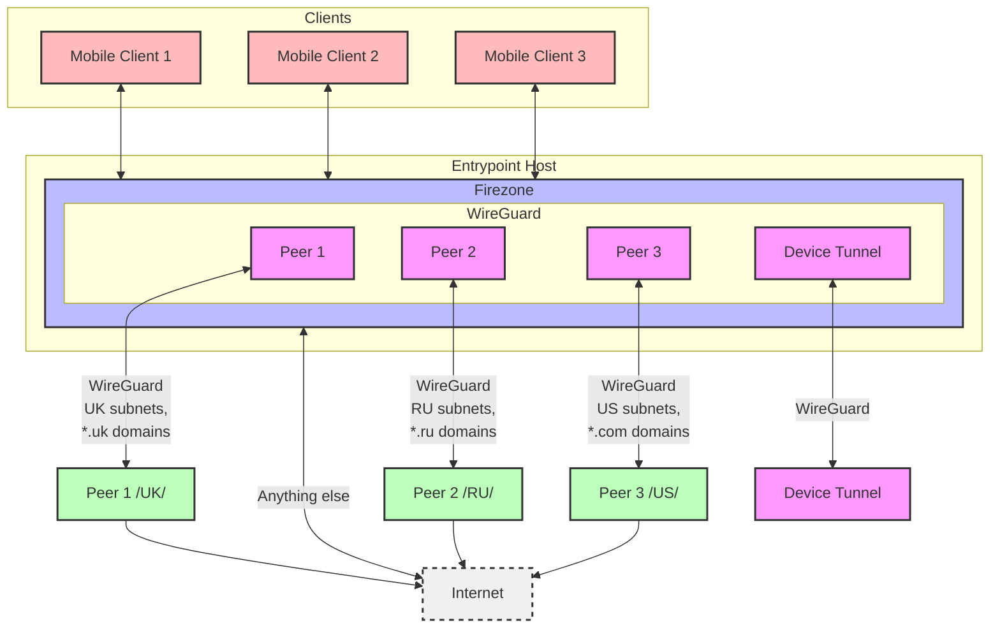

MRVPN2
======

```mermaid
graph TD

    T1[Device Tunnel]       
    subgraph Clients
    direction TB

        C1[Mobile Client 1]
        C2[Mobile Client 2]
        C3[Mobile Client 3]

    end
         
    subgraph EH [Entrypoint Host]
            direction TB
        subgraph FZ[Firezone]
            subgraph WireGuard
                PT1[Peer 1  ]
                PT2[Peer 2  ]
                PT3[Peer 3  ]
                PDT[Device Tunnel]
            end
        end 
    end

    P1[Peer 1 /UK/ ]
    P2[Peer 2 /RU/ ]
    P3[Peer 3 /US/ ]

    I["Internet"] 
    style I fill:#f0f0f0,stroke:#333,stroke-width:2px,stroke-dasharray: 5 5


    PT1 <--> |WireGuard <br>UK subnets,<br> *.uk domains| P1
    PT2 <--> |WireGuard <br>RU subnets,<br> *.ru domains| P2
    PT3 <--> |WireGuard <br> US subnets,<br> *.com domains| P3
    PDT <--> |WireGuard| T1
   
    C1 <--> FZ
    C2 <--> FZ
    C3 <--> FZ
    FZ <--> |Anything else| I
    

    
    P1 --> I
    P2 --> I
    P3 --> I

    classDef default fill:#f9f,stroke:#333,stroke-width:2px;
    classDef entrypoint fill:#bbf,stroke:#333,stroke-width:2px;
    classDef peers fill:#bfb,stroke:#333,stroke-width:2px;
    classDef clients fill:#fbb,stroke:#333,stroke-width:2px;
    
    class FZ entrypoint;
    class P1,P2,P3 peers;
    class C1,C2,C3 clients;
```