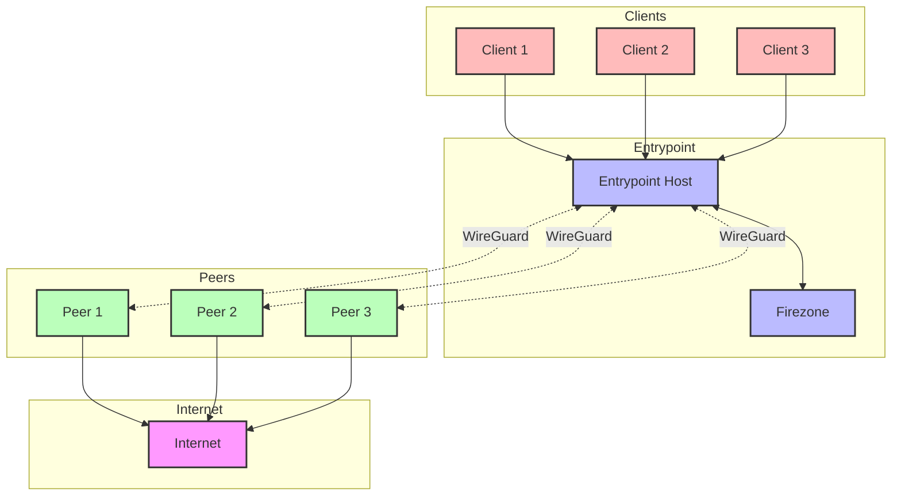

MRVPN2
======

```mermaid
graph TD
    subgraph Internet
        I[Internet]
    end

    subgraph Entrypoint
        E[Entrypoint Host]
        FZ[Firezone]
    end

    subgraph Peers
        P1[Peer 1]
        P2[Peer 2]
        P3[Peer 3]
    end

    subgraph Clients
        C1[Client 1]
        C2[Client 2]
        C3[Client 3]
    end

    C1 --> E
    C2 --> E
    C3 --> E

    E <--> FZ

    E <-.->|WireGuard| P1
    E <-.->|WireGuard| P2
    E <-.->|WireGuard| P3

    P1 --> I
    P2 --> I
    P3 --> I

    classDef default fill:#f9f,stroke:#333,stroke-width:2px;
    classDef entrypoint fill:#bbf,stroke:#333,stroke-width:2px;
    classDef peers fill:#bfb,stroke:#333,stroke-width:2px;
    classDef clients fill:#fbb,stroke:#333,stroke-width:2px;
    class E,FZ entrypoint;
    class P1,P2,P3 peers;
    class C1,C2,C3 clients;
```