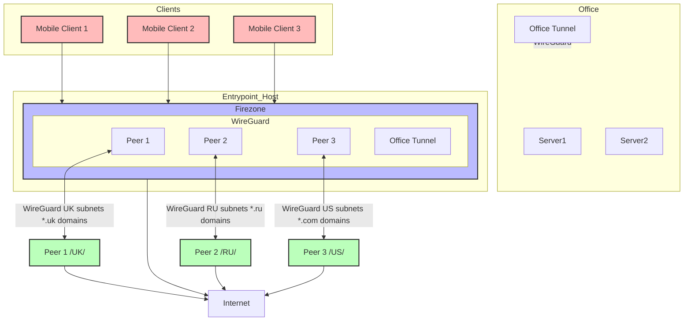

# MRVPN2

MRVPN2 is an Ansible collection for deploying VPN infrastructure using Firezone and WireGuard.

## Features

- **Geo routing** - Route traffic based on destination IP country code
- **Domain routing** - Route traffic based on destination domain
- **Mesh networking** - Connect everything in a mesh topology
- **WireGuard tunnels** - Deploy WireGuard tunnels via Docker
- **OSPF routing** - Dynamic routing with FRRouting
- **OIDC authentication** - External identity provider integration

## Project Structure

```
mrvpn2/
├── galaxy.yml                 # Ansible Galaxy collection metadata
├── README.md                  # This file
├── roles/                     # Ansible roles
│   ├── docker-wireguard/      # WireGuard tunnel management
│   ├── firezone/              # Firezone VPN server
│   └── mrvpn2/                # MRVPN2 orchestration
├── plugins/                   # Custom Ansible plugins
│   ├── modules/               # Custom Ansible modules
│   └── filter/                # Jinja2 filters
├── templates/                 # Jinja2 templates for services
├── startup-templates/         # Installation-specific configurations
│   ├── ansible.cfg            # Ansible configuration
│   ├── inventory.yml          # Ansible inventory template
│   ├── mrvpn_config.yml       # VPN topology configuration
│   ├── deployment-config.yml  # Deployment settings
│   ├── deploy_vpn.yml         # Main deployment playbook
│   ├── deploy_exit_node.yml   # Exit node deployment
│   ├── deploy-ci.yml          # CI/CD optimized deployment
│   ├── configure_oidc.yml     # OIDC configuration playbook
│   ├── galaxy.yml             # Galaxy collection template
│   ├── requirements.yml       # Ansible dependencies
│   └── .gitlab-ci.yml         # GitLab CI/CD pipeline
└── mrvpn2-master/             # Original project reference
```

## Architecture



## Quick Start

### Prerequisites

- Linux servers with SSH access
- Ansible 2.9+ installed locally
- Git

### Step 1: Clone and Prepare

```bash
# Clone the repository
git clone https://github.com/your-org/mrvpn2.git
cd mrvpn2

# Copy startup templates
cp -r startup-templates/* .

# Install Ansible dependencies
ansible-galaxy collection install -r requirements.yml
```

### Step 2: Configure Your Environment

#### Edit inventory.yml

```yaml
---
all:
  hosts:
    "your-main-host":
      ansible_host: "YOUR_MAIN_SERVER_IP"
      ansible_user: "root"
      ansible_private_key_file: "~/.ssh/id_rsa"
      ansible_ssh_common_args: "-o PasswordAuthentication=no -o PubkeyAuthentication=yes -o IdentitiesOnly=yes -o ConnectTimeout=30"
      ansible_host_key_checking: false
      ansible_ssh_retries: 3
      ansible_python_interpreter: "/usr/bin/python3"
    "your-exit-host":
      ansible_host: "YOUR_EXIT_SERVER_IP"
      ansible_user: "root"
      ansible_private_key_file: "~/.ssh/id_rsa"
      ansible_ssh_common_args: "-o PasswordAuthentication=no -o PubkeyAuthentication=yes -o IdentitiesOnly=yes -o ConnectTimeout=30"
      ansible_host_key_checking: false
      ansible_ssh_retries: 3
      ansible_python_interpreter: "/usr/bin/python3"
  children:
    entrypoints:
      hosts:
        "your-main-host":
    exitnodes:
      hosts:
        "your-exit-host":
```

#### Edit mrvpn_config.yml

```yaml
---
mrvpn_config:
  entrypoint: "your-main-host"
  mrvpn_base_dir: /opt
  tunnels:
    wg_exit1:
      subnet: "10.10.10.0/24"
      hosts:
        "your-main-host":
          allowed_nets: [ 0.0.0.0/0 ]
          compose_service: firezone
          masquerade: true
          table: "off"
        "your-exit-host":
          expose: 51620
          allowed_nets: [ 0.0.0.0/0 ]
          masquerade: true
          table: "off"
  routing:
    routes:
      - interface: wg_exit1
        metric: 300
        static:
          - 0.0.0.0/0
    pbr_mark: 200
    table: 200
    interfaces:
      - wg-firezone
      - wg_exit1
  services:
    firezone:
      - wg-firezone
      - wg_exit1
  firezone:
    fz_server_url: "https://your-vpn.example.com"
    fz_client_subnet: 10.0.100.0/24
    fz_client_gateway: 10.0.100.1
    fz_admin: "admin@your-domain.com"
    fz_admin_password: "{{ lookup('env', 'FZ_ADMIN_PASS') }}"
    fz_wireguard_port: "51620"
    fz_client_allowed_subnets:
      - "192.168.100.0/24"
```

#### Edit deployment-config.yml

```yaml
---
deployment_config:
  services:
    firezone:
      deploy: true
    wireguard:
      deploy: true
    mrvpn:
      deploy: true

  network:
    vpn_subnet: "10.0.100.0/24"
    vpn_gateway: "10.0.100.1"
    wg_port: "51620"

  docker:
    compose_version: "2.33.1"
    restart_policy: "always"

  firewall:
    enable: true
    policy: "deny"
    allowed_ports:
      - port: "22"
        proto: "tcp"
        comment: "SSH"
      - port: "443"
        proto: "tcp"
        comment: "HTTPS"
      - port: "80"
        proto: "tcp"
        comment: "HTTP"
      - port: "51620"
        proto: "udp"
        comment: "WireGuard"
    allowed_networks:
      - source: "10.0.100.0/24"
        dest: "192.168.100.0/24"
        proto: "tcp/udp"
        ports: "0-65535"
        comment: "VPN to internal network"

  monitoring:
    enable: false
    log_level: "info"
```

### Step 3: Set Environment Variables

```bash
# Required variables
export FZ_ADMIN_PASS="your_secure_password_here"
export FZ_SERVER_URL="https://your-vpn.example.com"

# Optional: OIDC configuration (skip if not needed)
export YANDEX_CLIENT_ID="your_yandex_client_id"
export YANDEX_CLIENT_SECRET="your_yandex_client_secret"
```

### Step 4: Deploy Main VPN Server

```bash
# Deploy Firezone and basic infrastructure
ansible-playbook -i inventory.yml deploy_vpn.yml
```

Wait for deployment to complete. Check the output for any errors.

### Step 5: Access Firezone Web Interface

1. Open `https://your-vpn.example.com` in your browser
2. Login with the admin credentials you set
3. Configure users and policies as needed

### Step 6: Deploy Exit Node (Optional)

If you have an exit node server, deploy it after the main server is running:

```bash
# Deploy WireGuard exit node
ansible-playbook -i inventory.yml deploy_exit_node.yml
```

### Step 7: Configure OIDC (Optional)

If you want to use external authentication providers:

```bash
# Configure Yandex OIDC
ansible-playbook -i inventory.yml configure_oidc.yml \
  -e oidc_provider=yandex \
  -e target_host=your-main-host
```

**Note:** OIDC configuration is manual and optional. If you don't need external authentication, skip this step. Firezone works perfectly with built-in user management.

### Step 8: Create Test Users

Create test VPN users through the Firezone web interface:

1. Go to Settings → Users
2. Click "Add User"
3. Enter user email
4. The user will receive an invitation email

### Step 9: Download VPN Clients

1. Users can download WireGuard clients from the Firezone web interface
2. Or use the mobile apps directly
3. All traffic will be routed through your VPN infrastructure

### Troubleshooting

#### Check Service Status

```bash
# On your main server
docker ps
docker-compose ps

# Check Firezone logs
docker logs firezone-firezone-1
```

#### Common Issues

1. **SSH Connection Failed**: Check your SSH key and server access
2. **Docker Installation Failed**: Ensure the server has internet access
3. **Firewall Blocks Traffic**: Check UFW rules on the server
4. **OIDC Not Working**: Verify your OIDC provider credentials

#### Logs Location

- Ansible logs: Local terminal output
- Docker logs: `docker logs <container_name>`
- Firezone logs: Available in the web interface

### Next Steps

1. Configure additional users and policies
2. Set up monitoring and alerts
3. Configure backup and recovery
4. Scale with additional exit nodes if needed

## Components

### Core Components

- **Firezone** - Open-source VPN server and web interface
- **WireGuard** - Modern VPN protocol for tunnels
- **Docker** - Container runtime for services
- **FRRouting** - OSPF routing for mesh networking

### Optional Components

#### OIDC Authentication (Optional)

MRVPN2 supports external OIDC providers for authentication. Currently supported:
- **Yandex OAuth** - Direct Yandex authentication
- **Zitadel** - OIDC identity provider (deployed separately)

**Note:** OIDC is completely optional. Firezone works perfectly with built-in user management. Only configure OIDC if you need external authentication providers.

To configure OIDC after deployment:
```bash
# For Yandex OAuth
ansible-playbook -i inventory.yml configure_oidc.yml -e oidc_provider=yandex

# For Zitadel (requires separate deployment)
ansible-playbook -i inventory.yml configure_oidc.yml -e oidc_provider=zitadel
```

#### Exit Nodes (Optional)

Deploy additional WireGuard exit nodes for geo-routing:
```bash
ansible-playbook -i inventory.yml deploy_exit_node.yml
```

## Configuration

MRVPN2 uses a modular configuration approach with templates in `startup-templates/`:

- **`inventory.yml`** - Ansible inventory with server definitions
- **`mrvpn_config.yml`** - VPN topology and routing configuration
- **`deployment-config.yml`** - Deployment settings and service toggles
- **`ansible.cfg`** - Ansible configuration for the deployment

### Environment Variables

Required variables:
- `FZ_ADMIN_PASS` - Firezone admin password
- `FZ_SERVER_URL` - Firezone server URL

Optional variables:
- `YANDEX_CLIENT_ID` - Yandex OAuth client ID
- `YANDEX_CLIENT_SECRET` - Yandex OAuth client secret
- `ZITADEL_CLIENT_ID` - Zitadel client ID
- `ZITADEL_CLIENT_SECRET` - Zitadel client secret

## Deployment

### Single Command Deployment

```bash
# Install dependencies
ansible-galaxy collection install -r requirements.yml

# Deploy VPN infrastructure
ansible-playbook -i inventory.yml deploy_vpn.yml
```

### Multi-stage Deployment

```bash
# 1. Deploy main VPN server
ansible-playbook -i inventory.yml deploy_vpn.yml

# 2. Deploy exit nodes (optional)
ansible-playbook -i inventory.yml deploy_exit_node.yml

# 3. Configure OIDC (optional)
ansible-playbook -i inventory.yml configure_oidc.yml
```

### CI/CD Deployment

Use the provided `.gitlab-ci.yml` template for automated deployment through GitLab CI/CD.

## Requirements

### System Requirements
- **Ansible** 2.9+
- **Docker** with Docker Compose
- **Python** 3.6+
- **Linux servers** with SSH access

### Server Requirements
- Ubuntu/Debian
- Root or sudo access
- Internet connectivity
- At least 2GB RAM, 2 CPU cores

## Troubleshooting

### Common Issues

**SSH Connection Failed**
- Verify SSH key is properly configured
- Check server firewall allows SSH (port 22)
- Ensure user has sudo privileges

**Docker Installation Failed**
- Check internet connectivity on target servers
- Verify package manager is available
- Try manual Docker installation if automated fails

**Firewall Blocks Traffic**
- UFW rules are configured automatically
- Check server firewall status: `sudo ufw status`
- Verify required ports are open

**OIDC Configuration Issues**
- Verify OIDC provider credentials
- Check discovery document URL is accessible
- Ensure callback URLs are properly configured

### Logs and Debugging

```bash
# Ansible logs
ansible-playbook -i inventory.yml deploy_vpn.yml -vvv

# Docker logs
docker ps
docker logs <container_name>

# Service status
systemctl status firezone
systemctl status docker
```

## Security

- SSH keys used only for deployment
- Sensitive data stored in environment variables
- Firewall rules configured automatically
- Docker networks isolated
- Admin passwords should be strong and unique

## Support

For issues and questions:
1. Check the Quick Start section above for detailed examples
2. Review Ansible and Docker logs for error details
3. Verify all environment variables are set correctly
4. Ensure server networking and firewall rules are correct

## License

GPL-2.0-or-later

## Author

Alexander K <ansible-alex@xxl.cx>  