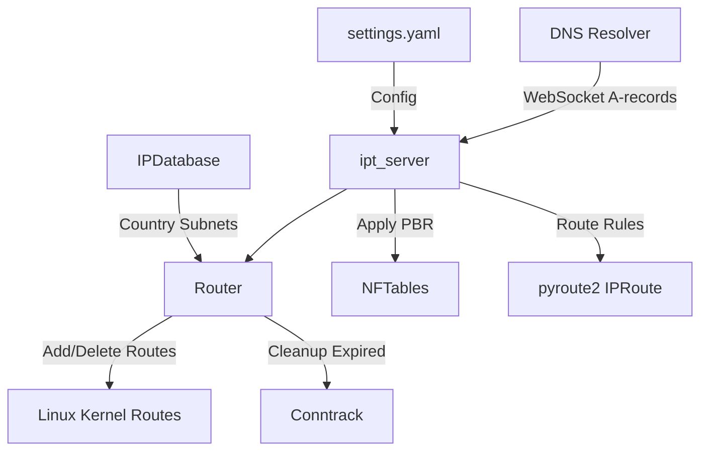

### 1. `README.md` (Общий обзор)

# ipt_server

`ipt_server` is a Python-based service designed for dynamic network routing management, integrating Policy-Based Routing (PBR), WireGuard VPN support, and real-time DNS-based route updates via WebSocket. It leverages `pyroute2` for route manipulation, `nftables` for traffic filtering, and an interval tree for efficient route conflict resolution. The service is ideal for scenarios requiring flexible traffic routing based on domains, countries, or specific subnets.

## Features
- **Dynamic Routing**: Add and remove routes based on DNS A-records received over WebSocket.
- **Policy-Based Routing (PBR)**: Direct traffic through specified interfaces using `fwmark` and custom routing tables.
- **TTL Management**: Automatically expire routes with configurable time-to-live (TTL) settings.
- **Conflict Resolution**: Prioritize routes using a `weight` system for overlapping subnets or domains.
- **Country-Based Routing**: Route traffic for entire countries using IP ranges from the DB-IP database.

## Architecture

The following diagram illustrates the high-level architecture of `ipt_server`:



- **DNS Resolver**: Sends A-records to `ipt_server` via WebSocket.
- **ipt_server**: Core service handling configuration, WebSocket, and PBR.
- **Router**: Manages route lifecycle and conflict resolution.
- **Linux Kernel Routes**: Stores active routes manipulated via `pyroute2`.
- **NFTables**: Filters traffic based on PBR rules.
- **IPDatabase**: Provides subnet data for country-based routing.

## Prerequisites
- Python 3.12+
- Docker (optional, for containerized deployment)
- Linux OS with `nftables`, `iproute2`, and `conntrack-tools` installed
- WireGuard interface (e.g., `wg-firezone`) for VPN routing

## Installation

1. Clone the repository:
   ```bash
   git clone https://github.com/yourusername/ipt_server.git
   cd ipt_server
   ```

2. Install dependencies:
   ```bash
   pip install -r requirements.txt
   ```

3. Prepare the configuration file (see [CONFIGURATION.md](CONFIGURATION.md)):
   ```bash
   cp settings.example.yaml settings.yaml
   nano settings.yaml
   ```

4. Run the service:
   ```bash
   python3 ipt_server.py
   ```

Or use Docker:
```bash
docker build -t ipt_server .
docker run -d --network host --cap-add NET_ADMIN --cap-add NET_RAW -v $(pwd)/settings.yaml:/settings.yaml ipt_server
```

## Usage
- Start the service and send A-records via WebSocket to `ws://<host>:<ws_port>` (default port: 8765).
- Example WebSocket message:
  ```json
  {"query": "example.com", "content": "93.184.216.34", "name": "example.com", "type": 1}
  ```

For detailed configuration options, see [CONFIGURATION.md](CONFIGURATION.md). For insights into TTL, weight, and routing principles, refer to [FEATURES.md](FEATURES.md).

## Contributing
Feel free to open issues or submit pull requests. Ensure your changes are tested and documented.

## License
MIT License
```


---

